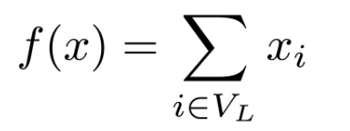
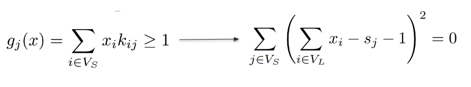

# QCSensorsProject

### Setup

Create and start the virtual environment

`python3 -m venv venv;`
`source venv/bin/activate`

Install the dependencies

`pip install -r requirements.txt`

### Developement

If you add any dependency

`pip freeze > requirements.txt`

### QUBO model

The basic QUBO model to implement is the following:

where every `x_i` represents a sensor node, it is 1 if and only if the sensor in that node has been activated.

The basic constraint to implement is the following:

where `V_s` is the set of street point nodes and `V_l` is the set of sensor nodes. This constraint specifies that each
street point must be covered by at least a single active sensor. `s_j` is a slack variable of 1 bit, because the
inequality must be bigger or equal than 1. 
